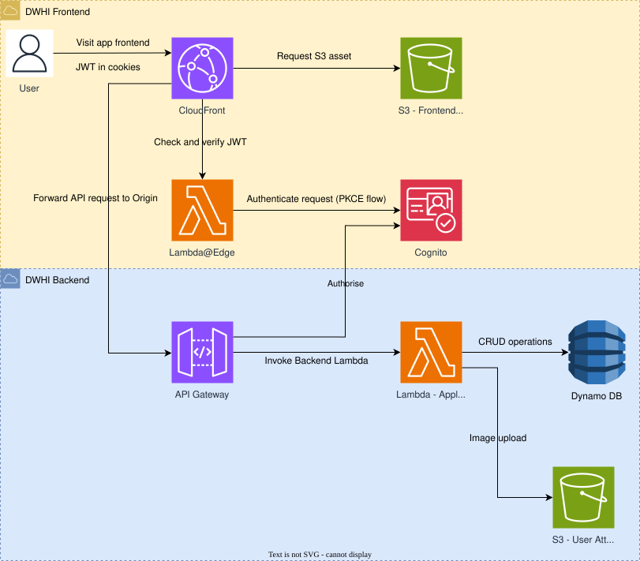

## Do We Have It Backend and Infrastructure

Do We Have It is an inventory tracker for folders and items, with custom attributes, templates, and image uploads to describe what you own.

This repo contains the DWHI backend and its AWS infrastructure. The backend is an ASP.NET Core Web API that stores folder, item, and template data in a single DynamoDB table, supports image uploads to S3, and uses Cognito JWTs for authorization. The infrastructure is managed with AWS CDK and provisions the API Lambda, API Gateway, DynamoDB, and S3 image bucket, plus a CI pipeline for deployments.

### TL;DR



## Repo contents

- `backend/`: ASP.NET Core Web API (Lambda-hosted) for folders, items, templates, and image attachments.
- `infra/`: AWS CDK stacks for DynamoDB, S3 images bucket, API Gateway, Lambda, Cognito authorizer, and CI pipeline.
- `dwhi-arch-layout.svg`: Architecture overview diagram.

## Backend

### Prerequisites

- .NET 8 SDK
- Docker (for LocalStack)

### Local development

```bash
cd backend
dotnet restore
dotnet run
```

Swagger UI is available at `https://localhost:7026/swagger`.

### Local AWS (LocalStack)

```bash
cd backend/local-aws
docker compose up -d
```

LocalStack initializes the `Inventory` DynamoDB table and the `dwhi-images` S3 bucket.

### Configuration

- `backend/appsettings.json`: Default configuration for DynamoDB, S3, Cognito, and frontend URL.
- `backend/appsettings.Development.json`: LocalStack endpoints and development settings.
- `backend/implementation.md`: API contract and single-table DynamoDB design.
- `backend/implementation-image-attachment.md`: Image upload/download plan and DTO changes.

### Tests

```bash
dotnet test backend/DoWeHaveItApp.Tests/DoWeHaveItApp.Tests.csproj
```

## Infrastructure

### Prerequisites

- Node.js 20+
- AWS CDK v2
- AWS credentials with permissions to deploy Lambda, API Gateway, DynamoDB, S3, ACM, and IAM
- A DNS zone for the API custom domain

### Stacks

- `InfraStack`: Orchestrates `BaseStack` and `ApiStack`.
- `BaseStack`: DynamoDB `Inventory` table, S3 images bucket, and SSM parameters.
- `ApiStack`: .NET 8 Lambda, HTTP API Gateway with Cognito JWT authorizer, ACM certificate, and custom domain.
- `DWHIBackendPipelineStack`: S3 source bucket, CodePipeline + CodeBuild deploy job, GitHub OIDC role.

### Configuration

- `infra/config/shared.ts`: Base domain for the API.
- `infra/config/backend/config.api.ts`: API domain, SSM base path, Lambda handler name.
- `infra/config/backend/config.dynamodb.ts`: DynamoDB table settings.
- `infra/config/backend/config.ci.ts`: CI artifact keys and GitHub OIDC repo name.

### Deploy (manual)

```bash
dotnet publish backend/DoWeHaveItApp.csproj -c Release -r linux-x64 --self-contained false -o backend/bin/lambda-publish
cd infra
npm install
npm run build
npx cdk deploy InfraStack
```

### Deploy (pipeline)

The CI pipeline expects two zip artifacts uploaded to the source bucket created by `DWHIBackendPipelineStack`:

- `backend/bin/lambda-publish` zipped to the key in `infra/config/backend/config.ci.ts`.
- The `infra/` source zipped to the `infraSourceObjectKey`.

GitHub Actions uses the OIDC role output by the stack to upload these artifacts and trigger CodePipeline. The workflow uses the following publish and packaging commands:

```bash
dotnet publish backend/DoWeHaveItApp.csproj -c Release -r linux-x64 --self-contained false -o backend/bin/lambda-publish --no-restore
zip -r backend-source.zip backend/bin/lambda-publish
zip -r infra-source.zip infra
```
